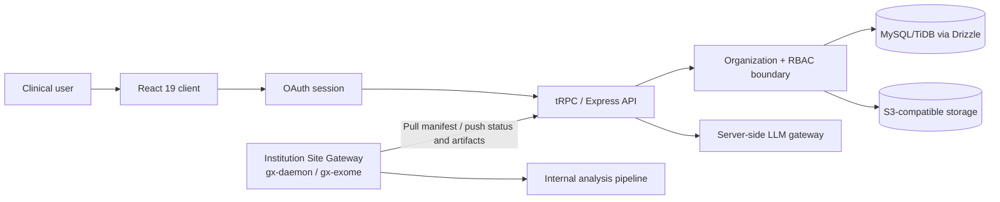

# Genolyx Variant Interpreter 개발자 인수인계서

| 항목 | 내용 |
|---|---|
| 제품 | **Genolyx Variant Interpreter (GVI)** |
| 문서 목적 | 신규 개발자가 코드베이스를 안전하게 이해하고, 기능을 훼손하지 않으면서 후속 개발을 시작할 수 있도록 하는 기술·제품 인수인계서 |
| 작성일 | 2026-07-23 |
| 작성자 | GVI |
| 현재 단계 | 임상 유전체 해석 SaaS의 **검증 가능한 첫 릴리스 기반** |
| 기준 문서 | 본 문서보다 실제 소스와 스키마가 우선하며, 불일치 시 코드를 기준으로 갱신한다. |

> **임상 안전 고지:** GVI는 전문가의 판단을 보조하는 임상 유전체 해석 제어면입니다. AI가 생성하는 답변·초안은 근거 기반 보조 결과일 뿐이며, 임상 판정·승인·전자서명·환자별 최종 의사결정을 대신할 수 없습니다. 실제 진단 또는 치료 의사결정에 사용하려면 기관별 분석 검증, QMS, 규제 검토, 데이터 라이선스 및 개인정보 보호 승인이 별도로 필요합니다. [1] [3] [4]

---

## 1. 먼저 읽을 내용

새 개발자는 코드 수정 전에 다음 순서로 이 문서를 사용하는 것이 좋습니다. 우선 [`README.md`](../README.md)에서 제품 원칙과 기본 실행 명령을 읽고, 이어서 [`architecture.md`](architecture.md)와 [`security-model.md`](security-model.md)에서 테넌트 경계와 분석 실행 경계를 확인합니다. 실제 데이터 관계는 [`drizzle/schema.ts`](../drizzle/schema.ts)가 유일한 기준이며, 화면의 상태·접근성 구현 범위는 [`VALIDATION.md`](../VALIDATION.md)에 정리되어 있습니다. [1] [2] [3] [4] [5]

특히 다음 세 가지는 후속 개발의 **변경 불가 원칙**으로 취급해야 합니다.

1. 모든 임상 데이터 읽기·쓰기는 검증된 `organizationId` 범위 안에서 수행한다.
2. AI는 근거를 요약하거나 초안을 제안할 수 있으나 판정 승인과 보고서 서명을 수행하지 않는다.
3. 서명된 보고서는 직접 수정하지 않으며 amendment 버전으로만 변경 이력을 남긴다.

---

## 2. 제품 목적과 범위

GVI는 FASTQ 또는 VCF 입력에서 시작해 **Germline·Somatic 변이 검토, Evidence Ledger 기반 근거 추적, 전문가 판정, 전자서명 보고서와 감사 추적**을 하나의 조직 단위 워크플로로 연결하는 SaaS입니다. 웹 애플리케이션은 임상 운영 제어면이며, 장시간 실행되는 FASTQ 정렬·variant calling 작업은 웹 요청 프로세스가 아니라 기관 내부 Site Gateway가 수행하도록 분리되어 있습니다. [1] [2]

| 구현된 범위 | 현재 동작 방식 | 의도적으로 제외하거나 후속 검증이 필요한 범위 |
|---|---|---|
| 조직·프로젝트·멤버 | 조직 생성, 멤버 초대·수락·취소, 역할 변경, 활성 조직 전환 | SSO/SAML, SCIM, 세분화된 프로젝트별 멤버십 |
| 케이스 접수 | Germline/Somatic 목적, 동의 항목, 샘플, VCF/FASTQ 파일 메타데이터 | 의료기록시스템 연동, 기관별 동의서 템플릿 관리 |
| 분석 작업 | VCF ingest와 FASTQ/Gateway 작업 manifest·이벤트·상태 저장 | 실제 `gx-daemon`/`gx-exome` 배포, 재시도·스케줄링·SLI 운영 |
| 변이 해석 | 변이, 근거, ACMG/AMP criterion, Germline/Somatic interpretation, 전문의 승인 | 임상 지침별 완전한 자동 분류 및 외부 지식베이스 라이선스 운영 |
| AI Copilot | Evidence Ledger만 인용하는 요약·초안·제한사항·다음 단계 제안 | 모델 평가 체계, 기관별 프롬프트 정책, PHI 최소화·마스킹 정책 |
| 보고서 | 승인된 해석 기반 초안, 검토, 임상의 전자서명, SHA-256 snapshot, amendment | 규제형 PDF 출력, PKI 서명, 원본 문서 WORM 보존 |
| 보안·감사 | 서버 RBAC, 조직 격리, 감사 이벤트, 보안 투명성 콘솔 | SSO/MFA, SIEM, WORM, DLP, 정식 컴플라이언스 증적 |

---

## 3. 아키텍처 개요

GVI는 **웹 제어면**과 **기관 내부 분석 실행면**을 분리한다. 이 분리는 서버리스 웹 런타임에서 장시간·고자원 분석을 실행하지 않게 하고, 원시 FASTQ 및 기관 네트워크 경계를 Site Gateway 쪽에 유지하기 위한 설계다. [2]



| 계층 | 주 기술 | 책임 | 수정 시 주의점 |
|---|---|---|---|
| Client | React 19, TypeScript, Wouter, TanStack Query, Tailwind 4, shadcn/ui | 권한 기반 화면, 임상 워크플로, 상태·접근성 UI | UI에서 숨겨도 서버 권한 검증을 대체하지 않는다. |
| API | Express 4, tRPC 11, Zod | 인증 컨텍스트, 입력 검증, 조직 범위, 상태 전이, 감사 기록 | 새 procedure는 첫 줄에서 조직 권한을 검증해야 한다. |
| Domain | 순수 TypeScript 정책 모듈 | ACMG/AMP 코드, Copilot citation guard, 보고서 해시·불변성 | 생성형 모델 대신 결정적 검증을 먼저 둔다. |
| Persistence | Drizzle ORM, MySQL/TiDB | 조직 소유 메타데이터, 복합 FK, audit event | 스키마 변경은 migration을 생성·검토·적용해야 한다. |
| Storage | S3 호환 객체 저장소 | 원본 파일과 산출물 바이트 | DB에는 바이트 대신 key·URL·MIME·크기·SHA-256만 저장한다. |
| Site Gateway | 기관 내부 분석 컴포넌트 | manifest pull, FASTQ 분석, 상태·산출물 push | 웹 런타임에서 worker·데몬을 실행하지 않는다. |
| AI Gateway | 서버측 LLM API | Evidence Ledger 기반 근거 요약과 초안 | 클라이언트에서 모델 API 키를 노출하지 않는다. |

`server/_core/`는 템플릿·런타임 인프라 계층이다. 기능 개발은 원칙적으로 `server/routers/`, `server/domain/`, `client/src/pages/`, `client/src/components/`, `drizzle/schema.ts`에 국한하고, 인프라 확장이 필요한 경우에만 `_core` 변경을 검토한다.

---

## 4. 요청, 인증, 조직 경계

브라우저는 OAuth 세션을 통해 사용자를 식별한다. 각 tRPC procedure는 요청된 `organizationId`에 대해 사용자의 활성 멤버십과 **액션 수준 권한**을 우선 검증한 뒤, 검증된 조직 ID를 포함하는 쿼리·변경을 실행한다. 성공적인 임상·운영 변경은 같은 조직의 `audit_events`에 기록된다. 비멤버의 직접 객체 조회는 리소스 존재를 감추기 위해 `NOT_FOUND`로 수렴한다. [2] [3]

```text
Browser request
  → OAuth session user
  → input validation (Zod)
  → active organization membership
  → action permission check
  → organization-scoped database/storage operation
  → append-only audit event
```

### 역할과 핵심 권한

| 역할 | 주 업무 | 대표 허용 액션 | 명시적 금지 |
|---|---|---|---|
| `administrator` | 조직·멤버·프로젝트·보안 운영 | 멤버 관리, 프로젝트 관리, 감사·보안 조회 | 보고서 전자서명 |
| `analyst` | 케이스·변이·근거 큐레이션 | 케이스 생성, 변이 검토, 근거·판정 초안 편집 | 판정 승인, 전자서명, 멤버 관리 |
| `clinician` | 임상 검토와 sign-out | 판정 승인, 보고서 검토·전자서명 | 조직·멤버 보안 관리 |
| `viewer` | 허용된 데이터 열람 | 케이스·변이·보고서 조회 | 생성·수정·승인·서명·초대 |

권한 카탈로그는 `shared/permissions.ts`에 있고, 서버 경계는 `server/domain/tenant.ts`와 각 router가 사용한다. 새 기능을 추가할 때는 **권한 문자열 추가 → 역할 매핑 → 서버 procedure 보호 → UI 노출 제어 → Vitest 거부 테스트**의 순서를 지킨다. [3]

---

## 5. 데이터 모델과 수명주기

### 5.1 주요 Aggregate

| Aggregate | 주요 테이블 | 수명주기·불변조건 |
|---|---|---|
| Tenant | `organizations`, `organization_members`, `organization_invites` | 조직은 모든 임상 데이터의 루트다. 멤버십은 `(organizationId, userId)`로 유일하며 status가 `active`여야 한다. |
| Operating unit | `projects` | 프로젝트 코드는 조직 내에서 유일하다. case는 `(projectId, organizationId)` 복합 FK로 소속을 강제한다. |
| Clinical case | `cases`, `samples`, `case_files` | case는 목적(`germline`/`somatic`), 입력 유형(`vcf`/`fastq`), reference build, 동의 정보를 가진다. 파일은 객체 저장소 참조와 SHA-256 메타데이터만 보관한다. |
| Analysis | `analysis_jobs`, `analysis_events` | pipeline은 `vcf_ingest`, `gx_exome`, `gx_somatic`이며 idempotency key와 상태·진행률·manifest를 저장한다. |
| Variant review | `variants`, `evidence_items`, `interpretations`, `criteria_assessments` | 변이는 case 내 normalized ID로 유일하다. 해석은 draft→in_review→approved 상태와 version을 가진다. |
| AI trace | `ai_conversations`, `ai_messages` | 사용자·assistant 메시지와 citation ID를 조직·변이 범위로 보관한다. |
| Report | `reports` | draft→in_review→signed 상태를 거치며 signed 시 snapshot·hash·signer를 고정한다. 변경은 `amended`/parent report 버전으로 이어진다. |
| Audit | `audit_events` | 행위자, 대상, action, before/after, request ID, IP, user agent, 시각을 보관한다. |

모든 테넌트 소유 테이블에는 `organizationId`가 포함된다. case·sample·file·job·variant·evidence·interpretation·report 등의 하위 관계는 ID와 `organizationId`를 함께 사용하는 복합 FK 또는 복합 고유 키를 사용해 타 조직 부모 참조를 방지한다. [2] [5]

### 5.2 상태 전이

| 도메인 | 상태 | 개발 규칙 |
|---|---|---|
| Case | `draft` → `queued` → `running` → `review_ready` → `in_review` → `reported` | `failed` 상태와 분석 이벤트를 별도로 기록한다. 대용량 분석은 Gateway를 통해 비동기로 처리한다. |
| Variant review | `unreviewed` → `reviewing` → `reviewed` 또는 `flagged` | 리뷰 상태 변경은 조직 범위와 권한을 가진 사용자만 수행한다. |
| Interpretation | `draft` → `in_review` → `approved` | analyst는 초안 편집, clinician은 승인 권한을 가진다. |
| Report | `draft` → `in_review` → `signed` → `amended` | `draft`만 편집 가능하며 signed/reviewed/amended 버전은 직접 수정하지 않는다. |

---

## 6. 핵심 사용자 워크플로

### 6.1 케이스 접수와 파일 처리

사용자는 `/cases/new`에서 프로젝트, 임상 목적, reference build, 동의, 샘플을 입력한 뒤 VCF 또는 FASTQ 입력을 연결한다. VCF/TSV는 제한된 크기에서 포털 직접 업로드·파싱이 가능하고, FASTQ 또는 대용량 입력은 `analysis_job`과 manifest를 생성한다. 파일 바이트는 S3에 저장하고, DB에는 `storageKey`, URL, MIME type, byte size, SHA-256만 기록한다. 저장 키는 `organizations/{organizationId}/cases/{caseId}/files/...` 규칙을 만족해야 한다. [2] [5]

### 6.2 Site Gateway 계약

Site Gateway는 기관 내부 환경에서 **outbound**로 대기 작업 manifest를 가져오고, 내부 `gx-daemon`/`gx-exome` 파이프라인을 실행한 후 진행률·상태·산출물 메타데이터를 웹 API로 반환한다. GVI 웹 서버는 항상 켜져 있는 worker나 장시간 subprocess를 실행하지 않는다. 런타임 Gateway endpoint를 사용할 때 `GVI_GATEWAY_TOKEN`은 서버 비밀값으로 설정해야 하며, repository나 `.env`에 커밋하면 안 된다. 테스트는 별도 전용 토큰을 주입하므로 로컬 비밀값이 없어도 실행된다. [2] [3] [4]

### 6.3 변이 워크벤치와 Evidence Ledger

`/workbench/:caseId`는 변이 목록, 필터·정렬, 상세 주석, 근거, ACMG/AMP criterion, 해석 상태, Copilot 대화를 한 화면에서 다룬다. 외부 근거 refresh와 수동 Evidence Ledger 등록은 변이·조직 범위에서 일어나며, 근거에는 source, URL, accessedAt, excerpt, direction, evidence level이 남는다. 후속 기능도 **근거 원문·접근 시각·출처 링크 없는 임상 주장**을 저장하지 않도록 설계해야 한다. [1] [2]

### 6.4 AI Copilot

Copilot은 저장된 Evidence Ledger만 컨텍스트로 사용한다. LLM 결과는 answer, draft interpretation, cited evidence IDs, uncited claims, limitations, suggested next steps 형태로 구조화되고, 반환된 인용 ID가 현재 variant의 허용 근거 집합에 속하는지 서버가 검증한다. 허용되지 않은 인용이나 인용이 누락된 결과는 거부한다. 모델 선택, 대화 저장, query 오류·재시도는 워크벤치 UI에 분리되어 있다. [3] [4]

### 6.5 보고서와 전자서명

승인된 interpretation을 기반으로 report draft를 만든다. draft는 수정 가능하고 review 상태로 제출할 수 있으며, `clinician`만 review 중인 보고서를 서명할 수 있다. 서명 시 임상 내용과 식별 메타데이터를 정규화한 JSON snapshot 및 SHA-256 digest를 저장한다. 서명 후 내용 변경은 금지되고, 기존 signed report에서 amendment version을 생성하는 방식으로만 이어진다. [1] [2] [3]

---

## 7. 화면·라우트·권한 지도

`client/src/App.tsx`가 아래 라우트를 `DashboardLayout`과 `OrganizationProvider` 안에 등록한다. `DashboardLayout`은 권한에 따라 사이드바 메뉴를 숨기며, `OrganizationContext`의 조직·권한 조회가 실패하면 하위 라우트를 렌더링하지 않고 재시도 또는 로그아웃만 제공한다. [2] [4]

| 경로 | 화면 | 기본 읽기 권한·주요 액션 | 개발 시 확인할 상태 |
|---|---|---|---|
| `/` | Dashboard | `case:read` 기반 현황 | loading, onboarding empty, query error |
| `/cases` | Cases | `case:read`, 새 케이스는 `case:create` | 모바일 카드, 데스크톱 키보드 행 선택 |
| `/cases/new` | NewCase | `case:create` | 프로젝트 없음, 업로드·제출 오류 |
| `/cases/:id` | CaseDetail | `case:read`, report draft 권한 | tenant-hidden not found, 타임라인 오류 |
| `/workbench` | WorkbenchLanding | `variant:read` | 케이스 선택 안내 |
| `/workbench/:caseId` | Workbench | `variant:read`, evidence/interpretation/approval 권한 | query·mutation별 재시도, Copilot 오류 |
| `/reports` | Reports | `report:read` | 목록 empty, report 생성 진입 |
| `/reports/:id` | ReportEditor | `report:read`, draft edit/review/sign 권한 | 읽기 가드, 저장·서명 오류 |
| `/organization` | Organization | `member:manage` | 멤버·초대·역할 변경 오류 |
| `/audit` | AuditLog | `audit:view` | filter, empty, retry |
| `/security` | SecurityConsole | `security:view` | 격리 제어·프로젝트 범위 표시 |

공통 상태 UI는 `client/src/components/StatePanel.tsx`가 제공하는 `loading`, `empty`, `error`, `forbidden` 변형을 사용한다. 오류 상태에는 재시도 버튼과 live region이 있으며, 전역 CSS는 `:focus-visible`과 `prefers-reduced-motion`을 지원한다. 신규 화면을 추가할 때 loading·empty·error·forbidden·keyboard flow를 모두 설계하고 [`VALIDATION.md`](../VALIDATION.md) 라우트 표에 추가한다. [4]

---

## 8. 서버 코드 지도

| 위치 | 책임 | 신규 기능을 넣을 위치 |
|---|---|---|
| `server/routers.ts` | tRPC app router 조합 | 새 feature router를 import·mount한다. |
| `server/routers/organizations.ts` | 조직, 멤버, invite, security context, audit | 조직 설정·권한 관리 기능 |
| `server/routers/projects.ts` | 프로젝트 lifecycle | 프로젝트 관련 CRUD·관리 |
| `server/routers/cases.ts` | 케이스, 파일 upload, manifest·job | intake·file·analysis 기능 |
| `server/routers/variants.ts` | 변이 목록·상세, 근거, criterion, interpretation | 임상 해석 핵심 기능 |
| `server/routers/copilot.ts` | 모델 목록, 대화, cite-guarded ask | AI 보조 기능 |
| `server/routers/reports.ts` | draft, review, sign, amendment | 보고서 lifecycle |
| `server/routers/dashboard.ts` | 조직 범위 KPI 집계 | dashboard read model |
| `server/domain/tenant.ts` | 활성 멤버십, action permission, DB boundary | 보호 procedure의 공통 테넌트 경계 |
| `server/domain/acmg.ts` | criterion·classification 정책 | 결정적 임상 규칙 |
| `server/domain/copilotGuard.ts` | citation 소유권 검증 | AI safety policy |
| `server/domain/reportSnapshot.ts` | 상태 전이, mutable check, SHA-256 snapshot | report immutability |
| `server/domain/audit.ts` | audit event append | 새 변경 action audit |
| `server/gatewayAuth.ts` | Gateway Bearer 인증 | 기관 분석 연동 |

### 새 tRPC mutation의 권장 구조

```ts
// 1. zod input: organizationId와 domain input을 명시한다.
// 2. 조직 멤버십과 action permission을 가장 먼저 확인한다.
const membership = await requireOrganizationPermission(
  ctx.user.id,
  input.organizationId,
  "feature:action",
);

// 3. 모든 select/update/delete에 organizationId 조건을 포함한다.
// 4. 상태 전이는 domain policy로 검증한다.
// 5. 변경 전후와 request metadata를 audit event에 기록한다.
// 6. 성공 응답은 UI가 invalidate/retry할 수 있는 작고 명시적인 shape로 반환한다.
```

---

## 9. 로컬 개발과 데이터베이스 변경

### 9.1 기본 실행

```bash
pnpm install
pnpm dev

# 별도 검증
pnpm check
pnpm vitest run
pnpm build
```

현재 검증 기준은 `GVI_GATEWAY_TOKEN`을 환경에서 제거한 상태에서도 **7개 테스트 파일, 22개 테스트**가 통과하고 production bundle이 생성되는 것이다. 자세한 검증 근거는 [`VALIDATION.md`](../VALIDATION.md)를 참조한다. [4]

### 9.2 환경변수와 비밀값

| 분류 | 예시 | 개발 원칙 |
|---|---|---|
| 시스템 주입 | `DATABASE_URL`, `JWT_SECRET`, OAuth 관련 변수 | 코드나 커밋된 `.env`에 저장하지 않는다. |
| 임상 분석 연동 | `GVI_GATEWAY_TOKEN` | Gateway runtime에만 설정하며 최소 32자 이상의 강한 비밀값을 사용·회전한다. 테스트에는 불필요하다. |
| AI·저장소 | 서버측 LLM·S3 관련 런타임 자격 증명 | 서버 코드에서만 사용하고 클라이언트 번들에 노출하지 않는다. |

### 9.3 스키마 변경 절차

1. `drizzle/schema.ts`를 먼저 변경한다.
2. `pnpm drizzle-kit generate`로 migration SQL을 만든다.
3. 생성 SQL을 읽어 데이터 손실·인덱스·복합 FK·기존 데이터 영향 여부를 검토한다.
4. 승인된 환경에서 migration을 적용한다.
5. Drizzle schema, 실제 DB, 테스트 fixture·router query가 일치하는지 확인한다.

조직 소유 신규 테이블에는 `organizationId`를 필수로 넣고, 가능하면 `(id, organizationId)` 복합 unique key 및 부모의 복합 FK를 사용한다. `organizationId`만 추가하고 쿼리 조건·FK·권한 검사 중 하나를 누락하면 테넌트 격리 설계가 무너진다. [2] [3] [5]

---

## 10. 테스트·품질·배포 전 확인

| 테스트 영역 | 테스트 파일 또는 기준 | 기대 효과 |
|---|---|---|
| 테넌트 경계 | `server/domain/tenant.test.ts` | 비멤버 조직 접근을 은닉형 `NOT_FOUND`로 처리 |
| 권한 행렬 | `shared/permissions.test.ts` | analyst/clinician/viewer/admin의 액션 분리 |
| ACMG/AMP | `server/domain/acmg.test.ts` | 유효 코드·중복·분류·목적 제약 |
| Copilot guard | `server/domain/copilotGuard.test.ts` | 허용 근거 밖 citation 및 citation 누락 거부 |
| Report policy | `server/domain/reportSnapshot.test.ts` | 상태 전이·snapshot digest·불변성 |
| Audit metadata | `server/domain/audit.test.ts` | actor, target, before/after, request metadata |
| Gateway auth | `server/gatewayAuth.test.ts` | 자체 테스트 토큰 기반 Bearer auth·fail-closed 동작 |

배포 전에는 자동 테스트 외에 최소한 다음을 검토한다. 실제 임상 데이터에 대한 분석·재현성 검증, 접근 권한 시나리오, S3 접근 로그·수명주기, DB backup/restore, secret rotation, Site Gateway 회복 절차, 외부 근거 데이터의 라이선스, 개인정보 영향 평가, 기관별 sign-out SOP가 필요하다. 이 코드베이스의 테스트 성공은 의료기기·진단 규제 적합성이나 임상 검증을 의미하지 않는다. [3] [4]

---

## 11. 알려진 제약과 기술 부채

| 항목 | 현재 상태 | 영향 | 권장 후속 조치 |
|---|---|---|---|
| 외부 지식베이스 | 근거 구조와 refresh 경계는 있으나 기관 라이선스·동기화 전략이 필요 | 임상 근거 최신성·라이선스 리스크 | ClinVar, gnomAD, OMIM, CIViC, OncoKB 등별 소스 계약과 sync policy 확정 |
| FASTQ 분석 | manifest·Gateway 계약은 있으나 실제 기관 배포와 E2E 검증은 별도 | 웹 UI만으로 원시 분석 완결 불가 | gateway reference client, retry·idempotency·artifact 검증 구현 |
| 보고서 산출 | JSON snapshot·hash는 구현됐지만 규제형 PDF/PKI는 미구현 | 외부 문서·전자서명 적합성 한계 | versioned template, PDF rendering, certificate/PKI, long-term archive |
| 성능 | Vite의 500 kB 초과 chunk 경고가 있음 | 초기 로드 성능 저하 가능성 | route-level dynamic import, code splitting, bundle budget |
| 데이터 접근 | MySQL 환경에서 application/RBAC·query scope·FK로 격리 | 운영자·직접 DB 접근 위협은 별도 | DB 계정 최소 권한, 감사 보존, WORM/SIEM 연동 |
| AI 품질 | citation ownership guard는 있으나 임상 품질 평가셋은 미구축 | 근거 표현·환각·편향의 잔여 위험 | gold set, human review rubric, prompt/model versioning, monitoring |
| 조직 인증 | OAuth 기반 사용자 인증 | 엔터프라이즈 identity 요구 대응 부족 | SSO/SAML/OIDC, MFA, SCIM, JIT provisioning |

---

## 12. 후속 개발 로드맵

아래 로드맵은 **안전성과 운영 준비를 제품 기능보다 먼저** 처리하도록 우선순위를 정했다. 대규모 변경은 현재 저장소의 안정성을 보존하기 위해 별도 feature branch 또는 repository mirror에서 설계·검증한 뒤 pull request로 병합하는 방식을 권장한다.

### P0 — 실제 운영 전 필수 경계

| 과제 | 이유 | 선행 조건 | 완료 기준 |
|---|---|---|---|
| 기관별 Site Gateway reference implementation | FASTQ 분석 경계가 실제로 동작해야 한다. | gateway protocol 명세, 네트워크·secret 정책 | pull·progress·artifact push·replay·disconnect E2E 테스트 |
| 스토리지·DB 운영 보강 | 임상 파일과 메타데이터의 복구·보존 정책이 필요하다. | cloud account, KMS, backup 정책 | 최소 권한 S3 policy, encryption, lifecycle, restore drill 증적 |
| 정식 역할·접근 운영 | 관리자 탈취와 부적절한 sign-out을 줄여야 한다. | identity provider, 조직 SOP | MFA/SSO 계획, 정기 access review, break-glass 절차 |
| 감사 보존·SIEM 연계 | append-only 앱 로그만으로는 운영자 위협을 완전히 줄일 수 없다. | SIEM/WORM 저장소 선택 | immutable export, alert rule, 보존 기간, 감사 조회 SOP |
| 임상 release governance | 코드 기능과 임상 사용 승인을 분리해야 한다. | QMS, 의료 책임자, 법무 | versioned SOP, validation protocol, release sign-off, rollback plan |

### P1 — 분석·해석 정확도와 임상 워크플로 완성

| 과제 | 구현 방향 | 수용 기준 |
|---|---|---|
| VCF parser 강화 | multi-sample, genotype/FORMAT, complex variants, gzip/bgzip, robust error report 지원 | 표준·비정상 VCF corpus의 parser 테스트와 분리된 오류 메시지 |
| Germline/Somatic 정책 확장 | ACMG/AMP와 AMP/ASCO/CAP 적용 정책을 versioned rule set으로 분리 | rule version이 interpretation·report snapshot에 저장됨 |
| 외부 근거 소스 커넥터 | 라이선스·rate limit·accessedAt·raw payload·정규화 전략 포함 | source별 lineage와 refresh failure/audit 추적 |
| phenotype·질환 맥락 | HPO/질환 ontology 입력과 variant prioritization을 도입 | 환자 표현형이 우선순위·근거 노출에 traceable하게 반영 |
| 실무 보고서 템플릿 | 기관·검사 종류별 template, PDF, amendment 비교 view | 서명·amendment·PDF hash가 연결되고 export audit 남음 |
| QC와 sample 관계 | coverage, contamination, sample identity, tumor/normal pair QC 반영 | QC 경고가 sign-out 전 필수 검토 항목으로 노출됨 |

### P2 — AI 안전성과 평가 고도화

| 과제 | 구현 방향 | 수용 기준 |
|---|---|---|
| AI 평가셋 | 승인된 무식별 근거·판정 사례로 gold set 구축 | 정확성, citation precision, omission, harmful suggestion 지표 추적 |
| 모델·프롬프트 versioning | conversation에 model ID뿐 아니라 prompt/rule/evidence snapshot version 기록 | 결과 재현·비교가 가능한 audit trail |
| PHI 최소화 | LLM에 보내는 context를 evidence·variant 중심으로 제한하고 식별자 제거 | prompt payload 검사와 redaction 테스트 |
| reviewer workflow | Copilot draft accept/reject/edit 사유를 구조화해 수집 | human override와 quality feedback 대시보드 |
| source confidence | evidence strength와 contradiction을 명시적으로 시각화 | AI가 약한 근거를 강한 결론처럼 표현하지 않음 |

### P3 — 플랫폼 확장성과 성능

| 과제 | 구현 방향 | 수용 기준 |
|---|---|---|
| 프런트엔드 code splitting | route-level lazy loading과 bundle budget | Vite large chunk 경고 해소 또는 합리적 예외 문서화 |
| 대규모 목록 처리 | server pagination, cursor, virtualized table, filter index | 10만+ variant 시나리오의 latency·memory 목표 충족 |
| 작업 orchestration | job retry, dead-letter, idempotency, timeout, ownership lease | gateway 재시작·중복 delivery에도 정확히 한 번에 준하는 결과 |
| 관측성 | 구조화 로그, request correlation, metrics, tracing | p95 latency, error rate, queue lag, Gateway health 대시보드 |
| API versioning | Gateway·외부 통합에 versioned contract와 deprecation 정책 | 호환성 테스트와 migration window 보유 |

### P4 — UX·접근성·협업

| 과제 | 구현 방향 | 수용 기준 |
|---|---|---|
| 검토 큐 | assignee, priority, due date, handoff, comment·mention | 누가 어떤 variant를 검토 중인지 명확히 표시 |
| change comparison | interpretation/report amendment diff와 rationale diff | reviewer가 변경 전후·근거 변화를 한 화면에서 비교 |
| 접근성 회귀 테스트 | keyboard, screen reader, focus, contrast 자동 검사 | 신규 route마다 automated a11y gate 통과 |
| 다국어·기관 용어 | UI copy 및 report template locale 분리 | 한국어/영어 용어·날짜·보고서 template 전환 가능 |
| 알림 | assignment, review ready, signature pending, gateway failure | 사용자별 opt-in·audit 가능한 알림 채널 |

### P5 — 컴플라이언스와 엔터프라이즈 통합

| 과제 | 구현 방향 | 수용 기준 |
|---|---|---|
| SSO·SCIM | enterprise identity와 lifecycle 연결 | deprovision 즉시 access removal 및 audit 기록 |
| 규제 증적 패키지 | 요구사항-설계-위험-테스트 traceability matrix | release마다 검토 가능한 validation bundle |
| 데이터 보존·삭제 | 조직·프로젝트·case 단위 retention/legal hold | 삭제·보존 이벤트의 audit·복구 정책 문서화 |
| DLP·보안 스캔 | 파일 content scan, malware quarantine, egress control | 의심 파일 격리·운영 알림·검토 flow |
| 다기관 배포 | dedicated database, residency, tenancy migration | cross-region/data residency 정책과 migration test |

---

## 13. 개발 규칙과 Pull Request 체크리스트

### 기능 개발 순서

1. 먼저 domain vocabulary와 위협 모델을 작성한다.
2. 스키마와 migration을 설계하고 `organizationId`·복합 관계를 결정한다.
3. server domain policy와 tRPC procedure를 구현한다.
4. permission catalog 및 server-side guard를 추가한다.
5. UI에서 동일 권한으로 메뉴·버튼을 제어하되 서버 검증을 신뢰 경계로 둔다.
6. loading, empty, error/retry, forbidden, keyboard interaction을 포함한다.
7. 성공·거부·테넌트 침범·상태 전이·감사 기록을 Vitest로 검증한다.
8. README, architecture/security/validation 문서와 이 인수인계서를 업데이트한다.

### PR 체크리스트

- [ ] 새 테넌트 데이터가 `organizationId`와 조직 범위 쿼리를 가진다.
- [ ] 새 mutation이 `requireOrganizationPermission` 또는 동일 수준의 서버 guard를 먼저 수행한다.
- [ ] 역할별 UI 노출과 서버 거부 테스트가 함께 있다.
- [ ] 변경 전후가 필요한 action은 audit event에 남는다.
- [ ] 보고서·판정·AI 변경이 임상 안전 경계를 넘지 않는다.
- [ ] 테스트와 `pnpm check`, `pnpm build`가 통과한다.
- [ ] 신규 화면의 상태·접근성 항목이 `VALIDATION.md`에 반영됐다.
- [ ] 비밀값, 실제 환자 데이터, 라이선스 제약 데이터, 로컬 DB 덤프가 커밋되지 않았다.

---

## 14. 인수인계 완료 확인표

| 확인 항목 | 권장 확인 방법 |
|---|---|
| 로컬 실행 | `pnpm install && pnpm dev` 후 로그인·조직 컨텍스트 확인 |
| 자동 검증 | `pnpm check && pnpm vitest run && pnpm build` |
| 테넌트 격리 | 서로 다른 조직으로 직접 URL·API ID 주입 시나리오 테스트 |
| 임상 workflow | case → variant/evidence → interpretation approval → report sign/amendment 수동 점검 |
| AI guard | 허용되지 않은 citation·citation 없는 주장 거부 테스트 |
| Gateway | token·manifest·status·artifact 연동을 기관 환경에서 E2E 검증 |
| 운영 준비 | backup/restore, secret rotation, audit export, incident response rehearsal |

---

## References

[1]: ../README.md "Genolyx Variant Interpreter README"
[2]: architecture.md "GVI 아키텍처"
[3]: security-model.md "GVI 보안 모델"
[4]: ../VALIDATION.md "라우트·보안·자동 테스트 검증 기록"
[5]: ../drizzle/schema.ts "Drizzle 테넌트·임상 데이터 스키마"
[6]: ../server/routers.ts "tRPC router registry"
[7]: ../shared/permissions.ts "역할별 액션 권한 카탈로그"
[8]: ../PUSH_TO_GITHUB.md "로컬 검증 및 GitHub 푸시 안내"
